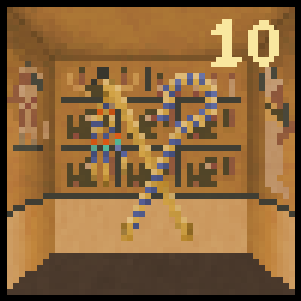

# Tomb of Tutankhamun
## 檔案說明
**Tutankhamun.exe**
遊戲執行檔，點擊即可執行遊戲。程式檔案皆壓縮在此檔案中。
**resource**
遊戲中所使用的各種資源皆放置於此資料夾中，包含圖片、音效、字體等資源。
**jdk-16.0.1**
遊戲執行檔所需的java語言的軟體開發工具包，包含Java執行環境、Java工具等。
**code**
本次遊戲的所有程式檔，內含resource資料夾。

## 檔案執行說明
**方法一**
點擊**Tutankhamun.exe**即可執行。
**方法二**
將code資料夾放置於編譯環境下（java JRE 1.8.0_292以上，即課程主機環境），進入資料夾後**javac *.java**的指令，編譯完畢後下**java Main**，即可開啟遊戲。

## 程式檔案介紹
**Main.java** 
遊戲主程式。
**Game.java**  
控制遊戲進行。
**GameMetaData.java**
紀錄遊戲進行中的資料，如通道上的卡牌、該回合尚在探險人數、移除的災難卡等資料。
**Resource.java**
紀錄遊戲遊戲種各項資源，如圖片、圖片路徑、字型及音效等資源。
****
**Card.java** 
「卡牌」，記錄該卡牌名稱、編號。
**Hazard.java**  
「災難卡」，玩家探險途中可能遇到的災難，每回合翻出兩張同類型的災難即該回合結束，繼承 Card 類別。
**Treasure.java**
「寶藏卡」，繼承 Card 類別。
**Gemstone.java**
「寶石卡」，玩家探險途中可能遇到的寶石，包含當前數值，繼承 Treasure類別。
**Artifact.java**
「神器卡」，每回合玩家探險途中可能遇到的神器，繼承Treasure類別。
****
**Agent.java**
「遊戲參與者」，紀錄其特定資料，包含持有寶藏數、帳棚內寶藏數、目前探索狀態等。
**Computer.java**
「電腦」玩家，操作電腦玩家角色，各自擁有不同邏輯，繼承 Agent 類別。
**Player.java**
「使用者」玩家，操作玩家角色，繼承 Agent 類別。
****
**StartUpFrame.java**
遊戲開始視窗，於進入遊戲時顯示，玩家可在此觀看遊戲規則以及選擇遊玩人數。
**GameFrame.java**
遊戲視窗。
**LevelPanel.java**
回合顯示區，當回合數改變時取得代表該回合的圖片並重新繪製於版面中。
**AgentDataPanel.java**
玩家資訊區，先判斷場上是否尚存在繼續探索之玩家，針對玩家狀態設置背景色及繪製文字。卡牌通道區將計算位置並依序繪製通。
**PathPanel.java**
卡牌通道區，計算位置並依序繪製通道上的卡牌，當玩家滾動滑鼠滾輪或按下按鍵時也需重新繪製。
**DecisionPanel.java**
玩家決定區，包含繼續STAY以及LEAVE兩個按鈕，當玩家選擇後，兩個按鈕即消失，直到下次詢問時才重新顯示。

## 遊戲規則 
遊戲共分為**五回合**，最終由帳篷內寶石數最多的玩家獲勝。每回合開始前該回合的神器卡洗入牌堆中，每次從牌堆中翻開一張卡牌，翻開下一張卡牌前玩家須決定是否繼續探險。
1. 選擇繼續探險之玩家，可能會遇到下列幾種卡牌：
(1)**寶石卡**：寶石平均分配給選擇探索的玩家，剩下寶石放在寶石卡上
    
(2)**神器卡**：保留至場上，當該回合選擇返回營地的玩家僅一位時，方可拿走神器
    
(3)**災難卡**：若該卡為場上重複類型的災難，回合結束，尚未返回營地之玩家，該回合寶藏歸零
       

1. 選擇返回營地之玩家
均分路徑上每張寶石卡剩餘的寶石，每回合的探索並不會影響放置於帳篷中的寶藏

## 操作說明
使用者透過點擊按鈕以及控制滑鼠進行操作。
* LEAVE按鈕：返回營地
* STAY按鈕：繼續探索

* 滑鼠操作：查看卡牌
  * 透過**左鍵拖移**或**滾輪滑動**查看通道中的卡牌
  * **點擊右鍵**即可回到最新卡牌的位置
  

##遊戲畫面介紹

####設定介面
設置遊玩人數後點擊Game Rule可切換至遊戲規則，點擊下方Start可開始遊戲。

####回合顯示
回合數及圖片隨著回合不同而改變。
    

####玩家資訊
由左至右之圖示及數值依序為玩家頭像、該回合寶石數、帳篷內寶石數以及玩家選擇情形。
* 玩家頭像由系統隨機分配。
* 該回合寶石數當玩家選擇返回營地時進行紀錄，回合結束時將寶石數加至帳篷中。
* 帳棚內寶石數作為遊戲勝負關鍵，玩家僅能見到自己帳棚內的寶石數。
* 遊戲進行時玩家尚未做出選擇，則顯示沙漏圖示，選擇完成則顯示打勾圖示。

每一個卷軸代表一位玩家。玩家選擇返回營地後，卷軸顏色即呈現灰色，同時該回合寶石數值停止顯示。可藉由玩家選擇情形圖示了解每一位玩家是否選擇完成。

####卡牌通道
顯出每一次抽出的卡牌，每一張卡牌下方含有該卡牌名稱。寶石卡及神器卡右上方會顯示當前剩餘數值，一但神器被取走或寶石被分完，圖示和數值即消失，僅留下背景。

####按鈕選擇
玩家透過按鈕選擇下一步動作，LEAVE代表返回營地，STAY代表繼續探險。

####結束畫面
遊戲結束時顯示全體玩家帳篷內的寶石數，寶石數最多的玩家為本次遊戲的獲勝者，玩家卷軸顯示出顏色並在最右方附上獎盃。
卡牌通道區卡牌移除並顯示結束遊戲的字樣。

####版權說明
本遊戲的背景音樂使用Spring Spring創作的Egyptian Style, Dune Style，為免費資源。

本遊戲所有圖片皆由小組成員繪製。
